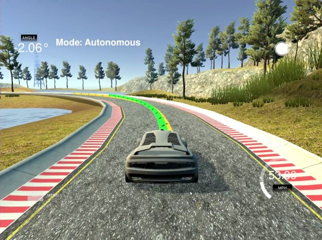
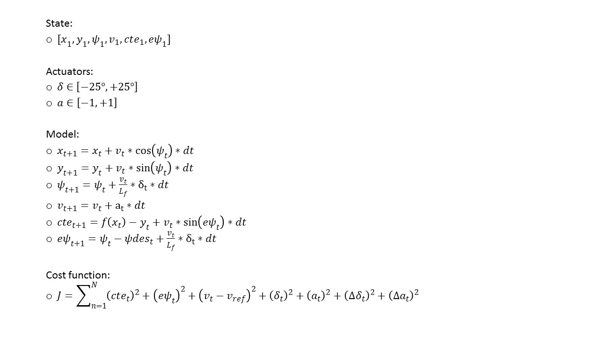

# Model Predictive Control
---
*Term 2, Project 10 of Udacity Self-Driving Car Nanodegree, by vuiseng9, March 2018*

> 

The goal of this project is to implement a Model Predictive Controller (**MPC**) in C++ to drive the car around the lake track of the Udacity Simulator. The implementation applies Ipopt and CppAD where car dynamics w.r.t actuations are modelled and solved to result in minimal error to the reference trajectory. The tasks are implementing the internal processing of the solver/optimizer which includes setting contraints on variables and actuators, coding the vehicle kinematic equations, initializing solver with vehicle state, designing error cost functions and tuning horizon timestep and interval. The design of the controller is also required to incorporate a 100 millisecond latency to model the delay of actuator dynamics.

> [Final Project Video](https://youtu.be/nTgQm9Jpwk4)

## Compilation
```bash
# Clone this repo
git clone https://github.com/vuiseng9/SDCND-P010-Model-Predictive-Control.git

# Make a build directory 
mkdir build && cd build

# Compile
cmake .. && make

# Run it: 
./mpc
```

## Implementation
### **The Model - Global Kinematic Model**
MPC approaches driving to follow a reference trajectory as a dynamic optimization problem. The dynamic optimizer continuously simulates the car's future trajectory, a number of steps into the future, with different actuator inputs and then selects the actuations based on the minimum cost. In this project, the **Global Kinematic Model** is used to model the car's dynamics and constraints in the optimizer. Let's begin the **Global Kinematic Model** with the state that it models.

* The **state** of a car comprises **x, y coordinates, velocity (v) and orientation (psi)**. Also, the **cross track error (cte) and orientation error (epsi)** are included in the state as their future state is a part of cost function.

* The **Global Kinematic Model** takes in **two input actuators, accelerator (a) and steering angle (delta)** that control the future state of a car. With that, the state evolving through time can be modelled with the following equations. The designed cost function is also shown below.
> 

### Polynomial Fitting and MPC Preprocessing
The initial condition of the state is required for dynamic optimizer, it is straight forward as **x, y, psi** will be zero as the car itself is the origin of the reference. **v** is set according to latest measurement, in the case of project, the measurement is returned from telemetry. 

For **cte**, it is the difference between current **y** and the 3rd order polynomial fitting of the waypoints (returned from the telemetry) at point x = 0. It is important to note that the waypoints are needed to convert to car reference before the polynomial fitting. Coordinate reference transformation involves [translation and rotation](http://planning.cs.uiuc.edu/node99.html). 

At any point on the 3rd order polynomial, the car is supposed to orient tangential to the polynomial at that particular point. In other words, the reference orientation at any point in x of fitting can be calculated from the inverse tangent of the derivative of the fitted polynomial. Hence, the epsi is the difference between psi and the reference, the inverse tangent of derivative at x = 0.
```c++
          // Transform waypts from map reference to car reference
          // Translation and Rotation
          Eigen::VectorXd wayptsx(ptsx.size());
          Eigen::VectorXd wayptsy(ptsy.size());

          for (int i = 0; i < ptsx.size(); i++) {
            double dx = ptsx[i] - px;
            double dy = ptsy[i] - py;
            wayptsx(i) = (dx * cos(-psi) - dy * sin(-psi));
            wayptsy(i) = (dx * sin(-psi) + dy * cos(-psi));
          }

          // Fit waypts to a 3rd order polynomial
          auto C = polyfit(wayptsx, wayptsy, 3);

          // Initial State
          // Since the State takes car as reference system 
          // some of the state will be zero as initial state
          double x_     = 0;
          double y_     = 0;
          double psi_   = 0;
          double v_     = v;
          double cte_   = polyeval(C, x_) - y_;
          // most term of epsi_ will be zero since x_ is zero
          double epsi_  = psi_ - atan(3*C[3]*pow(x_,2) + 2*C[2]*x_ + C[1]);
```

### Model Predictive Control with Latency
The initial condition is not complete if a latency 100ms is required to incorporate in the controller to account for the delay of actuator dynamic. The way to handle latency delay would be assuming the vehicle model starting from the current state for the duration of the latency. The resulting state after the delay is the new initial state for MPC. In other words, the initial state derived in previous section is updated with the aforementioned equations for a **dt** of 100ms.
```cpp
          // Account actuator dynamic delay by taking state 100ms in advance
          double latency_sec = 0.1;
          double Lf = 2.67;
          double x_delay    = x_    + v_ * cos(psi_) * latency_sec;
          double y_delay    = y_    + v_ * sin(psi_) * latency_sec;
          double psi_delay  = psi_  - v_ / Lf * delta * latency_sec;
          double v_delay    = v_    + a * latency_sec;
          double cte_delay  = cte_  + v_ * sin(epsi_) * latency_sec;
          double epsi_delay = epsi_ - v_ / Lf * delta * latency_sec;

          // Setup initial state
          Eigen::VectorXd state(6);
          state << x_delay, y_delay, psi_delay, v_delay, cte_delay, epsi_delay;
```
#### Path to solution - Tuning Timestep Length and Elapsed Duration
For simple begining, we started tuning the number of timestep, **N** and step period, **dt** without the actuation delay. With a reference velocity set to 40 mph and cost functions following the "MPC to line" quiz solution, the car experienced many abrupt steering. Then we penalized an additional factor of 10000 to the rate change of delta to limit drastic steering angle change between consecutive actuation. With that and t=25, dt=0.05, the car moved very smooth over and within the course of the track.

Turning on the actuation delay, the car was still able to drive decently with the same configurations although we can see that, as expected, the convergence during the sharper curve was not as fast as previously. To take a challenge, let's raise the velocity to 60 mph. The car was quite unstable at the turn with traces of a few spurious predictions were observed. We further penalized the steering change rate but it helped litte. We could see that, at the turning, the predicted trajectory would take more steps to be near the reference tracjectory. that implied that the cte was an underrated cost. Increasing 200 times the weight of cte, it improved but with N=25, it is was far into the future, the solver seemed to think it would have N actuations to converge. Hence N was set to 15 and it worked optimally for velocity 60 mph with actuation delay.

A few notes about tuning:
1. The total simulation horizon, N*dt is probably a relative to the reference velocity in the current set of constraints, cost and track. If the speed of the car is very fast, the horizon should be shorter as longer time would not help as the effect of approximate model error emerges into the simulation.

2. Given a fixed horizon, N should be kept minimal because large N incurred more simulation computation and it could become a burdening delay depending on the car's velocity.

3. Since the solver and simulator communicate asynchronously, it is observed that different resolutions are giving varying output. This is probably due to the processor need extra cycles for rendering. That gives an insight that the tuned value may be working well with all computers. Hence, the final N and dt are set at 15 and 0.05 with velocity at 60 mph although we successfully tuned for 80mph but slight unstable. Check out the [youtube link](https://youtu.be/nTgQm9Jpwk4) for result on our laptop.

## Simulation
Final Project Video can be found at [here](https://youtu.be/nTgQm9Jpwk4).

